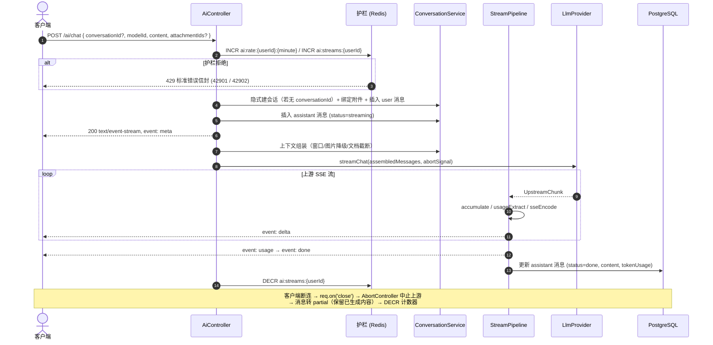

# Domain Model: AI 问答与流式会话 (AI Chat & Streaming)

本文档定义 AI 问答模块的数据库实体、值对象、Redis 结构、SSE 协议、上下文组装规则与 API 契约。架构决策见 [ADR-0004](./adr/ADR-0004-ai-chat-streaming.md)，术语见 [glossary](./glossary.md) 第 4 节。

---

## 1. 数据库实体设计 (TypeORM Entities)

### 1.1 `Conversation` 实体 (表名: `conversations`)

| 字段名 | 数据库类型 | TypeScript 类型 | 约束 / 索引 | 描述 |
| :--- | :--- | :--- | :--- | :--- |
| `id` | `uuid` | `string` | PK, 默认 `gen_random_uuid()` | 会话全局唯一标识 |
| `userId` | `uuid` | `string` | FK → `users.id`, Not Null, Index | 归属用户 |
| `title` | `varchar(128)` | `string` | Not Null | 会话标题（隐式创建时取首条内容前 20 字） |
| `lastMessageAt` | `timestamptz` | `Date` | Nullable, Index | 最近消息时间（列表排序键） |
| `createdAt` | `timestamptz` | `Date` | Not Null, Default: `now()` | 创建时间 |
| `updatedAt` | `timestamptz` | `Date` | Not Null, Default: `now()` | 更新时间 |

### 1.2 `Message` 实体 (表名: `messages`)

| 字段名 | 数据库类型 | TypeScript 类型 | 约束 / 索引 | 描述 |
| :--- | :--- | :--- | :--- | :--- |
| `id` | `uuid` | `string` | PK, 默认 `gen_random_uuid()` | 消息全局唯一标识 |
| `conversationId` | `uuid` | `string` | FK → `conversations.id`, Not Null, Index | 归属会话 |
| `role` | `varchar(16)` | `MessageRole` | Not Null | `user` / `assistant` / `system` |
| `content` | `text` | `string` | Not Null | 消息文本（assistant 为聚合全文） |
| `modelId` | `varchar(64)` | `string` | Nullable | 生成该消息的模型（仅 assistant） |
| `status` | `varchar(16)` | `MessageStatus` | Default: `'done'` | `streaming` / `done` / `partial` / `error` |
| `tokenUsage` | `jsonb` | `TokenUsage` | Nullable | `{promptTokens, completionTokens, totalTokens}`（仅 assistant） |
| `createdAt` | `timestamptz` | `Date` | Not Null, Default: `now()` | 创建时间 |
| `updatedAt` | `timestamptz` | `Date` | Not Null, Default: `now()` | 状态流转时间 |

### 1.3 `Attachment` 实体 (表名: `attachments`)

| 字段名 | 数据库类型 | TypeScript 类型 | 约束 / 索引 | 描述 |
| :--- | :--- | :--- | :--- | :--- |
| `id` | `uuid` | `string` | PK, 默认 `gen_random_uuid()` | 附件全局唯一标识 |
| `uploaderId` | `uuid` | `string` | FK → `users.id`, Not Null, Index | 上传者（下载权限判定依据） |
| `messageId` | `uuid` | `string` | FK → `messages.id`, Nullable, Index | 绑定的消息（上传时为 NULL，提问时回填） |
| `kind` | `varchar(16)` | `AttachmentKind` | Not Null | `image` / `document` |
| `filename` | `varchar(255)` | `string` | Not Null | 原始文件名 |
| `storagePath` | `varchar(512)` | `string` | Not Null | 磁盘存储路径（uuid + 扩展名） |
| `mimeType` | `varchar(128)` | `string` | Not Null | MIME 类型 |
| `size` | `integer` | `number` | Not Null | 字节数 |
| `extractedText` | `text` | `string` | Nullable | 文档提取的纯文本（仅 `document`） |
| `createdAt` | `timestamptz` | `Date` | Not Null, Default: `now()` | 上传时间 |

---

## 2. 领域枚举与值对象 (Enums & Value Objects)

```typescript
export enum MessageRole {
  USER = 'user',
  ASSISTANT = 'assistant',
  SYSTEM = 'system',
}

export enum MessageStatus {
  STREAMING = 'streaming',
  DONE = 'done',
  PARTIAL = 'partial',
  ERROR = 'error',
}

export enum AttachmentKind {
  IMAGE = 'image',
  DOCUMENT = 'document',
}

export interface TokenUsage {
  promptTokens: number;
  completionTokens: number;
  totalTokens: number;
}

export interface UpstreamChunk {
  delta?: string;
  usage?: TokenUsage;
  finishReason?: 'stop' | 'length';
}

export interface ChatRequest {
  modelId: string;
  messages: AssembledMessage[];   // 经上下文组装后的 OpenAI 格式消息
  signal: AbortSignal;
}

export interface ProviderConfig {
  id: string;
  baseURL: string;
  apiKey: string;
  models: { id: string; label: string }[];
}
```

---

## 3. Redis 护栏结构 (Redis Data Structures)

### 3.1 并发流计数 (Concurrent Stream Guard)
- **Key**: `ai:streams:{userId}`
- **Type**: `String`（INCR 计数）
- **TTL**: 600 秒（安全兜底，防进程崩溃泄漏）
- **流程**: `INCR` → 超限则 `DECR` 回退并拒绝（42902）；流结束（无论成败）`DECR`

### 3.2 频率限制 (Rate Limit, 固定窗口)
- **Key**: `ai:rate:{userId}:{yyyyMMddHHmm}`
- **Type**: `String`（INCR 计数）
- **TTL**: 60 秒
- **流程**: `INCR` → 超 `AI_RATE_LIMIT_RPM` 拒绝（42901）

---

## 4. SSE 事件协议 (Wire Protocol)

`POST /ai/chat` 响应 `Content-Type: text/event-stream`，事件序列：

```
event: meta
data: {"conversationId":"...","messageId":"...","modelId":"deepseek-chat"}

event: delta
data: {"content":"你好"}

event: delta
data: {"content":"，我是"}

event: usage
data: {"promptTokens":128,"completionTokens":42,"totalTokens":170}

event: done
data: {"messageId":"...","finishReason":"stop"}

: ping                                    ← 每 15s 心跳注释行
```

| 事件 | 时机 | Payload | 规则 |
| :--- | :--- | :--- | :--- |
| `meta` | 永远第一帧 | `{conversationId, messageId, modelId}` | 客户端据此关联 DB 记录 |
| `delta` | 0..N 帧 | `{content}` | 纯增量文本，客户端自行拼接 |
| `usage` | 末尾单帧（若上游提供） | `TokenUsage` | 在 `done` 之前 |
| `done` | 正常结束末帧 | `{messageId, finishReason: stop\|length\|abort}` | 发完即关闭连接 |
| `error` | 任何阶段失败 | `{code, message}` | code 复用 `error-codes.ts`；发完即关闭连接 |

**双轨制**：响应头未发送前的失败（鉴权/护栏/参数校验）走 ADR-0003 标准错误信封；响应头已发送后的失败走 `error` 事件。

---

## 5. 上下文组装规则 (Context Assembly)

输入：`conversationId` + 当前轮 `content` + 当前轮 `attachmentIds[]`。

1. 取最近 `AI_HISTORY_WINDOW`（默认 20）条消息，按时间升序。
2. **历史 user 消息**：图片附件 → 占位文本 `[图片: 文件名]`；文档附件 → `extractedText` 截断为前 `AI_DOC_TRUNCATE_CHARS`（默认 2000）字符 + `...[截断]`，与 content 拼接。
3. **当前轮 user 消息**：图片附件 → base64 data URL 内联（OpenAI vision `image_url` 块）；文档附件 → `extractedText` 完整注入。
4. **assistant 消息**：`content` 原样（含 `partial` 状态的半截回答，同样参与上下文）。
5. 可选 system prompt 由配置注入，置于 messages 首位。

---

## 6. 配置项 (Environment Variables)

| 变量 | 类型 | 默认值 | 描述 |
| :--- | :--- | :--- | :--- |
| `AI_PROVIDERS_JSON` | JSON 数组 | （必填，缺失 fail-fast） | `[{id, baseURL, apiKey, models:[{id, label}]}]` |
| `AI_MAX_CONCURRENT_STREAMS` | number | `3` | 单用户并发流上限 |
| `AI_RATE_LIMIT_RPM` | number | `20` | 单用户每分钟请求上限 |
| `AI_MAX_UPLOAD_MB` | number | `10` | 单文件上传大小上限 |
| `AI_HISTORY_WINDOW` | number | `20` | 上下文消息窗口条数 |
| `AI_DOC_TRUNCATE_CHARS` | number | `2000` | 历史文档文本截断长度 |
| `UPLOAD_DIR` | string | `./uploads` | 附件磁盘存储目录 |

---

## 7. API 面 (Endpoints)

| 接口 | 鉴权 | 描述 |
| :--- | :--- | :--- |
| `POST /conversations` | JWT | 创建会话（可空标题） |
| `GET /conversations?page=&size=` | JWT | 分页列表，按 `lastMessageAt` 降序 |
| `GET /conversations/:id/messages` | JWT | 消息历史（含附件元数据） |
| `PATCH /conversations/:id` | JWT | 重命名 |
| `DELETE /conversations/:id` | JWT | 删除（级联消息 + 附件记录 + 磁盘文件） |
| `POST /uploads` | JWT | multipart 多文件上传 → `{attachmentIds[]}` |
| `GET /uploads/:id` | JWT | 附件元数据（仅属主） |
| `GET /uploads/:id/download` | JWT | 文件本体流式下载（仅属主，不包信封） |
| `GET /ai/models` | JWT | 模型目录 `{id, label, provider}[]` |
| `POST /ai/chat` | JWT | SSE 流式问答，body `{conversationId?, modelId, content, attachmentIds?}` |

---

## 8. 流式问答时序图 (Chat Streaming Flow)



---

## 9. 错误码 (Error Codes)

| code | 常量 | HTTP | 触发场景 |
| :--- | :--- | :--- | :--- |
| 40401 | `CONVERSATION_NOT_FOUND` | 404 | 会话不存在或不属于当前用户 |
| 40402 | `ATTACHMENT_NOT_FOUND` | 404 | 附件不存在或不属于当前用户 |
| 40010 | `AI_MODEL_NOT_FOUND` | 400 | `modelId` 不在模型目录 |
| 40011 | `UPLOAD_TYPE_NOT_ALLOWED` | 400 | 文件类型不在白名单 |
| 40012 | `UPLOAD_TEXT_EXTRACT_FAILED` | 400 | 文档文本提取失败 |
| 41301 | `UPLOAD_TOO_LARGE` | 413 | 文件超 `AI_MAX_UPLOAD_MB` |
| 42901 | `AI_RATE_LIMITED` | 429 | 超频率限制 |
| 42902 | `AI_CONCURRENT_STREAM_LIMIT` | 429 | 超并发流上限 |
| 50201 | `AI_PROVIDER_ERROR` | 502 / SSE `error` 事件 | 上游供应商错误（双轨制） |
