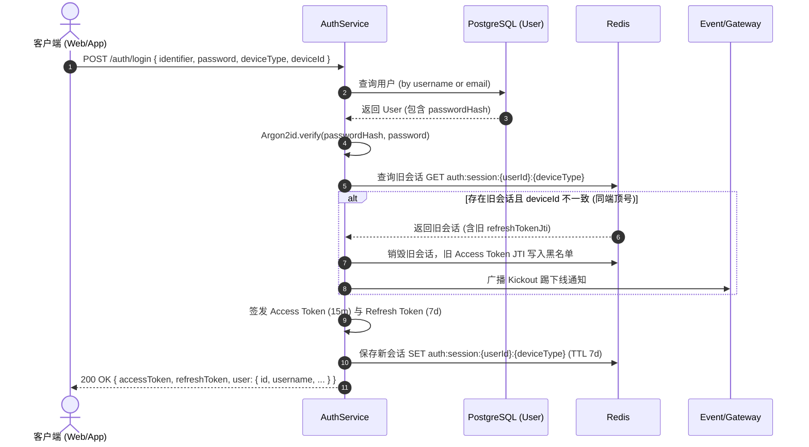
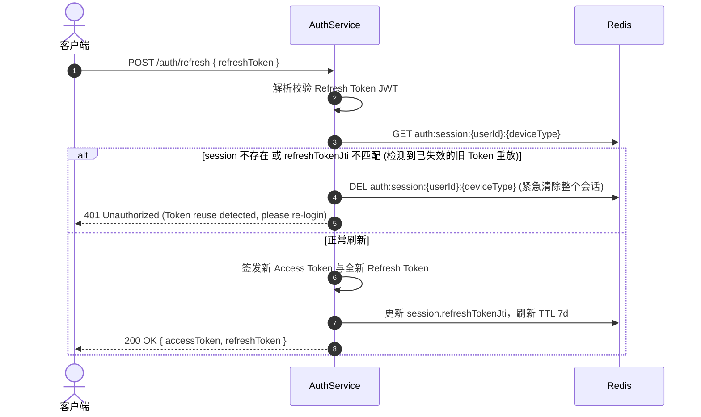

# Domain Model: 用户与认证会话模型 (User & Auth Session)

本文档详细定义登录认证模块的数据库模型、领域实体、Redis 结构及 DTO 契约。

---

## 1. 数据库实体设计 (TypeORM Entities)

### 1.1 `User` 实体 (表名: `users`)

| 字段名 | 数据库类型 | TypeScript 类型 | 约束 / 索引 | 描述 |
| :--- | :--- | :--- | :--- | :--- |
| `id` | `uuid` | `string` | PK, 默认 `gen_random_uuid()` | 用户全局唯一标识 |
| `username` | `varchar(32)` | `string` | Unique, Not Null, Index | 用户登录账号（不可重复） |
| `email` | `varchar(255)` | `string` | Unique, Not Null, Index | 用户邮箱地址（不可重复） |
| `passwordHash` | `varchar(255)` | `string` | Not Null | Argon2id 密码哈希值 |
| `nickname` | `varchar(64)` | `string` | Nullable | 用户昵称/显示名称 |
| `avatar` | `varchar(512)` | `string` | Nullable | 头像 URL |
| `status` | `varchar(20)` | `UserStatus` | Default: `'active'` | 用户状态 (`active`, `disabled`, `pending`) |
| `createdAt` | `timestamptz` | `Date` | Not Null, Default: `now()` | 注册创建时间 |
| `updatedAt` | `timestamptz` | `Date` | Not Null, Default: `now()` | 更新时间 |

---

## 2. 领域枚举与值对象 (Enums & Value Objects)

```typescript
export enum DeviceType {
  WEB = 'web',
  MOBILE = 'mobile',
  DESKTOP = 'desktop',
  OTHER = 'other',
}

export enum UserStatus {
  ACTIVE = 'active',
  DISABLED = 'disabled',
  PENDING = 'pending',
}

export interface JwtPayload {
  sub: string;         // userId
  username: string;    // 用户名
  deviceType: DeviceType;
  deviceId: string;
  jti: string;         // Token 唯一标识
}
```

---

## 3. Redis 会话存储结构 (Redis Data Structures)

### 3.1 活跃设备会话 (Active Session)
- **Key**: `auth:session:{userId}:{deviceType}`
- **Type**: `String` (JSON 序列化) 或 `Hash`
- **TTL**: 7 天 (与 Refresh Token 一致)
- **Value Structure**:
```json
{
  "deviceId": "d41d8cd98f00b204e9800998ecf8427e",
  "refreshTokenJti": "a7b3c2d1-e2f3-4a5b-6c7d-8e9f0a1b2c3d",
  "ip": "127.0.0.1",
  "userAgent": "Mozilla/5.0 ...",
  "lastActiveAt": "2026-09-18T10:00:00.000Z"
}
```

### 3.2 Access Token 黑名单 (Token Blacklist)
- **Key**: `auth:blacklist:{jti}`
- **Type**: `String` (值可为 `"1"` 或原因 `"logout" / "kicked"`)
- **TTL**: Access Token 剩余有效秒数（最大 900 秒）

---

## 4. 认证流程时序图 (Authentication Flows)

### 4.1 登录与踢下线流程 (Login & Kickout Flow)



### 4.2 令牌刷新与重放攻击防御 (Refresh Token Rotation & Reuse Detection)


